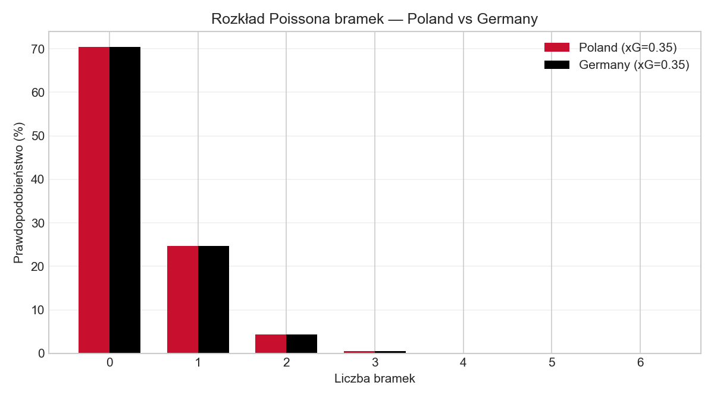
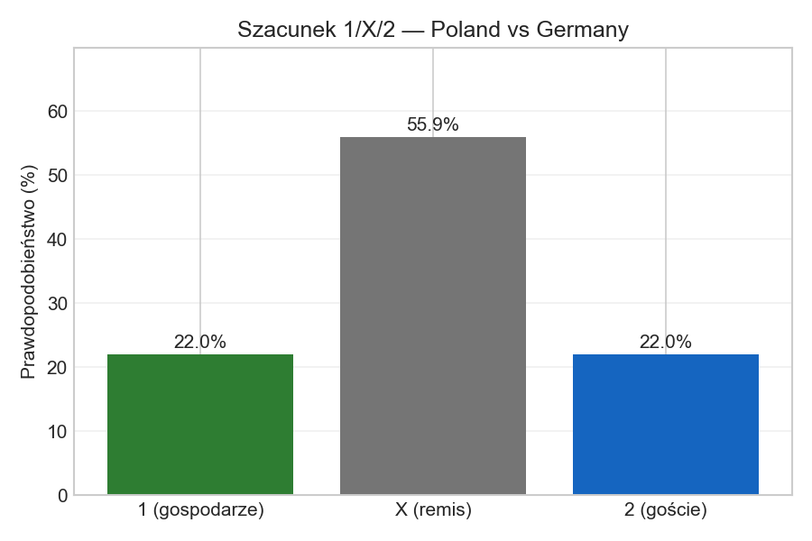
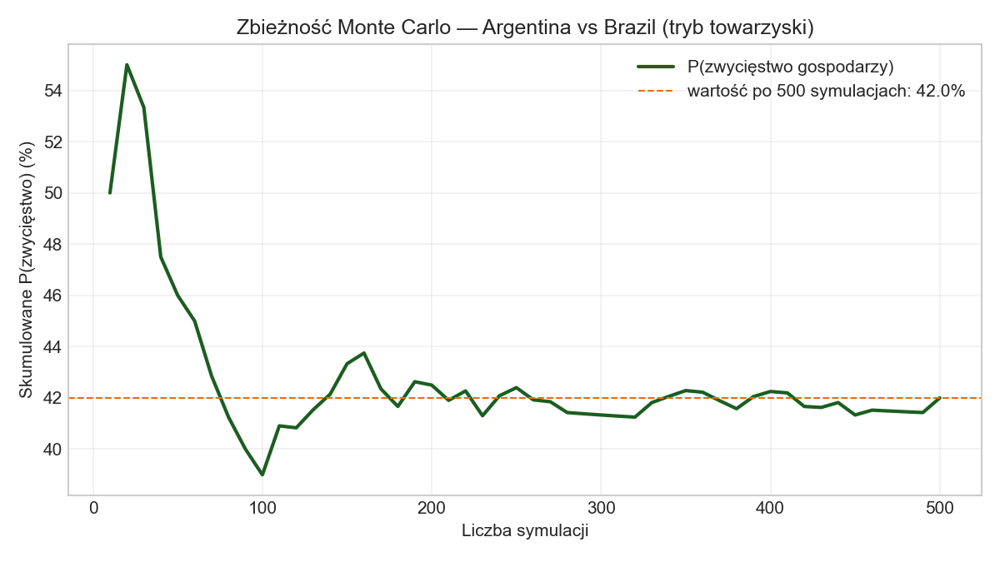
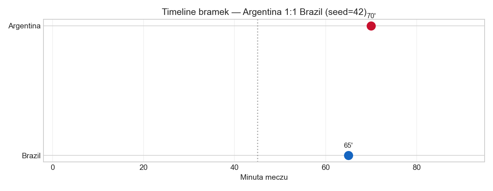
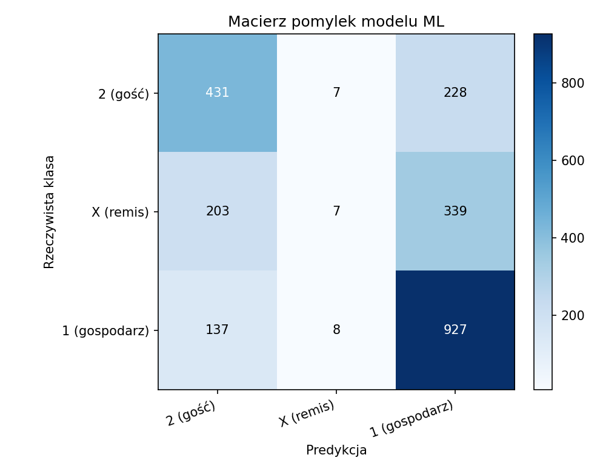
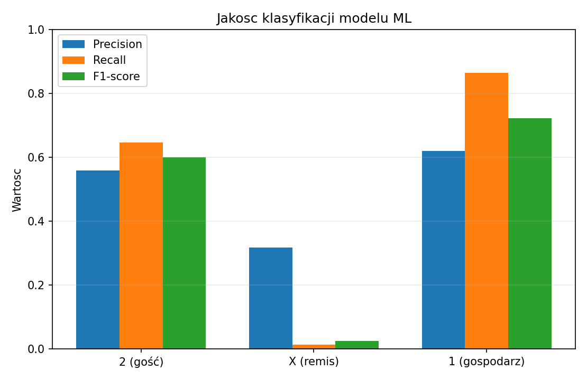
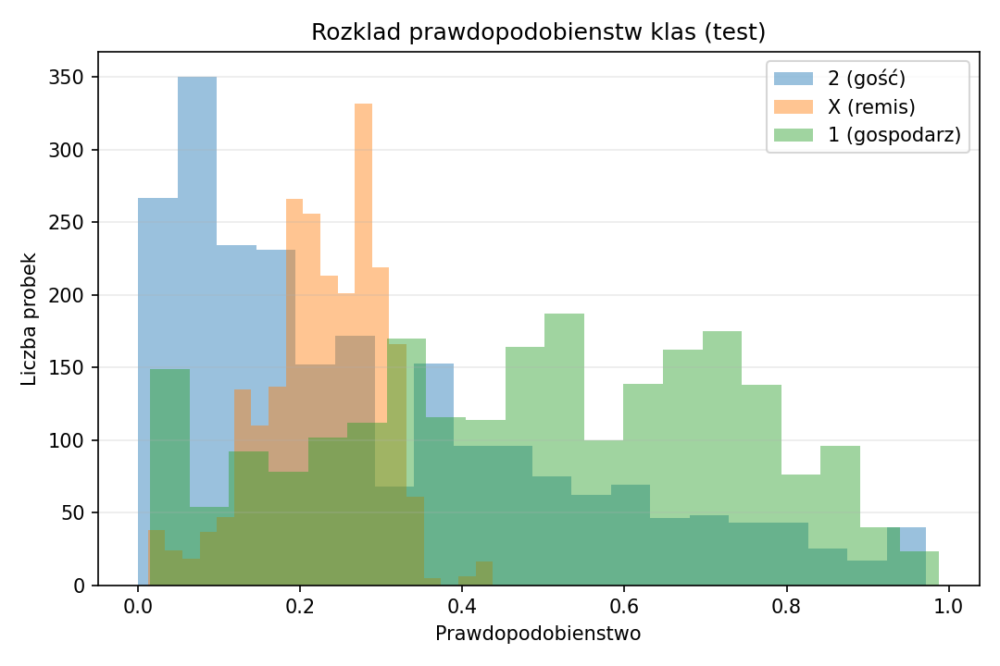

# Sprawozdanie z projektu zespołowego

**Przedmiot:** Projekt zespołowy (ZIMINS_D.320.02622.23)  
**Kierunek:** Informatyka, semestr 6  
**Projekt:** World Cup Predictor (aplikacja zespołowa + moduł symulacji)  
**Repozytorium GitHub:** [ProjektZesp---World-Cup-Predicter](https://github.com/Bartek0083/ProjektZesp---World-Cup-Predicter)  
**Autorzy:** Jakub Szych, Bartłomiej Muranowicz    

---

## Spis treści

1. [Streszczenie](#1-streszczenie)
2. [Cel projektu](#2-cel-projektu)
3. [Zespół i podział ról](#3-zespół-i-podział-ról)
4. [Połączenie komponentów projektu](#4-połączenie-komponentów-projektu)
5. [Proces projektowania](#5-proces-projektowania)
6. [Zarządzanie projektem (Agile / Scrum)](#6-zarządzanie-projektem-agile--scrum)
7. [Narzędzia współpracy](#7-narzędzia-współpracy)
8. [Przegląd technologii](#8-przegląd-technologii)
9. [Architektura rozwiązania](#9-architektura-rozwiązania)
10. [Realizacja techniczna](#10-realizacja-techniczna)
11. [Interfejs użytkownika](#11-interfejs-użytkownika)
12. [Prototypowanie i testowanie](#12-prototypowanie-i-testowanie)
13. [Standardy techniczne](#13-standardy-techniczne)
14. [Ocena ryzyka](#14-ocena-ryzyka)
15. [Budżet i finansowanie](#15-budżet-i-finansowanie)
16. [Etyka w projektowaniu](#16-etyka-w-projektowaniu)
17. [Utrzymanie i rozwój](#17-utrzymanie-i-rozwój)
18. [Wnioski](#18-wnioski)
19. [Instrukcja uruchomienia](#19-instrukcja-uruchomienia)
20. [Struktura plików](#20-struktura-plików)

---

## 1. Streszczenie

Projekt zespołowy **World Cup Predictor** to aplikacja webowa przewidująca wyniki Mistrzostw Świata i symulująca przebieg turnieju. **Główna aplikacja** (model ML Random Forest, symulacja grup i pucharów, zintegrowana animacja meczu) — Bartłomiej Muranowicz, repo `ProjektZesp---World-Cup-Predicter`, port **8011**.

**Moduł rozszerzony** (Jakub Szych) dodaje: symulację minutową z TheSportsDB, analizę Poissona (xG, 1/X/2), porównanie symulacji z rzeczywistością, wykresy i **27 testów**. Działa samodzielnie na porcie **8010** oraz jest zsynchronizowany w podfolderze `world-cup-predictor-symulacja/` tego samego repo.

Projekt realizowany był iteracyjnie w małym zespole dwuosobowym, z wykorzystaniem GitHub, komunikacji bezpośredniej i podejścia inspirowanego Scrumem. Koszt utrzymania wynosi **0 PLN** (darmowy plan TheSportsDB; uruchomienie lokalne).

---

## 2. Cel projektu

### 2.1 Cel zespołowy

Stworzenie działającej aplikacji prognostycznej dla Mistrzostw Świata, łączącej:

- predykcję wyników na podstawie danych historycznych (ML),
- symulację całego turnieju,
- **wizualizację przebiegu pojedynczego meczu** (moduł autora).

### 2.2 Cel modułu symulacji

Rozszerzenie koncepcji projektu o **szczegółową symulację przebiegu meczu** z animacją zdarzeń, trybami towarzyskim i turniejowym oraz regulaminem pucharowym (dogrywka, złota bramka, rzuty karne).

Oryginalny `simulator.py` w głównym repo losuje wynik jako `home_win` / `draw` / `away_win` bez minut bramek. Niniejsze rozwiązanie pokazuje *kiedy* padają bramki i *jak* mecz się kończy — warstwa prezentacji i regulaminu, kompatybilna koncepcyjnie z predyktorem ML.

### 2.3 Problemy użytkownika (Design Thinking — faza Empathize / Define)

| Problem użytkownika | Rozwiązanie w module |
|---|---|
| „Widzę tylko wynik końcowy, nie przebieg meczu” | Animacja minuta po minucie, boisko z markerami bramek |
| „Chcę zobaczyć dogrywkę i karne jak w TV” | Tryb turniejowy z pełnym regulaminem pucharowym |
| „Chcę symulować prawdziwe mecze” | Integracja TheSportsDB — mecze na dziś, nadchodzące, timeline |
| „Czy symulacja ma sens?” | Analiza przed meczem (xG, 1/X/2) i porównanie z rzeczywistością |

---

## 3. Zespół i podział ról

| Osoba | Rola | Zakres prac |
|---|---|---|
| **Bartłomiej Muranowicz** | Product Owner / koordynator | Główny projekt [World Cup Predictor](https://github.com/Bartek0083/ProjektZesp---World-Cup-Predicter): model ML, predykcja wyników, symulacja fazy grupowej i turnieju, backend (`api.py`, `model.py`, `simulator.py`), frontend głównej aplikacji. Specyfikacja wymagań modułu meczowego. |
| **Jakub Szych** | Developer modułu symulacji | Silnik symulacji minutowej (`match_engine.py`), interfejs webowy, integracja TheSportsDB, predykcje Poissona (`predictions.py`), statystyki (`match_stats.py`), testy, demo terminalowe, dokumentacja, Docker. |

### Komunikacja i podział obowiązków

- Spotkania zespołu (online / na uczelni) — uzgadnianie wymagań i integracji.
- Wymagania modułu meczowego zdefiniowane przez Bartka: animacja przebiegu, tryby towarzyski/turniejowy, dogrywka, złota bramka, karne.
- Moduł działa **samodzielnie** (port 8010) oraz jest **wpięty** w główną aplikację Bartka (port 8011) przez `match_engine.py` w korzeniu repo.

---

## 4. Połączenie komponentów projektu

Projekt zespołowy składa się z **dwóch warstw** w repozytorium `ProjektZesp---World-Cup-Predicter`:

| Warstwa | Ścieżka | Port | Autor główny | Opis |
|---|---|---|---|---|
| **Aplikacja główna** | korzeń repo | **8011** | Bartłomiej Muranowicz | Model ML (Random Forest), predykcja 1/X/2, symulacja grup i turnieju, symulacja minutowa w zakładce „Mecz” |
| **Moduł rozszerzony** | `world-cup-predictor-symulacja/` | **8010** | Jakub Szych | TheSportsDB, Poisson xG, statystyki timeline, porównanie z rzeczywistością, wykresy, 27 testów |

### Struktura repozytorium

```
ProjektZesp---World-Cup-Predicter/
├── model.py, data.py, simulator.py    # ML + turniej
├── match_engine.py                    # silnik minutowy (integracja FIFA)
├── api.py, run_server.py, frontend/   # aplikacja :8011
├── matches_2012_2026_...csv           # dane treningowe
└── world-cup-predictor-symulacja/     # moduł Jakuba (:8010)
    ├── predictions.py, match_stats.py
    ├── sportsdb_client.py
    └── SPRAWOZDANIE.md                # niniejszy dokument
```

Lokalnie ten sam moduł jest też w: `E:\6 semestr\world-cup-predictor-symulacja\` (kopia robocza zsynchronizowana z podfolderem w repo).

### Model ML (warstwa Bartka)

- **Algorytm:** RandomForestClassifier + kalibracja isotonic
- **Dane:** mecze 2012–2026 z rankingami FIFA (`matches_2012_2026_with_fifa_ranking_clean.csv`)
- **Wyjście:** prawdopodobieństwa `home_win` / `draw` / `away_win`
- **Artefakt:** `artifacts/world_cup_model.joblib`

Moduł Jakuba używa modelu **Poissona** (`predictions.py`) — uzupełnia ML o xG i symulację minutową z TheSportsDB, bez ponownego trenowania lasu losowego.

---

## 5. Proces projektowania

Projekt realizowano zgodnie z cyklem **Design Thinking** (uproszczony, adekwatny do skali zespołu):

| Faza | Działania w projekcie |
|---|---|
| **Empathize** | Analiza oryginalnego symulatora — brak przebiegu minutowego; potrzeba „relacji na żywo” jak w transmisji TV |
| **Define** | Specyfikacja: score bug, boisko, feed zdarzeń, tryby meczu, integracja API sportowego |
| **Ideate** | Warianty: terminal vs web; Poisson vs Monte Carlo; cache lokalny vs zapytania na żywo |
| **Prototype** | `demo_terminal.py` → `api.py` + `frontend/` → integracja TheSportsDB → funkcje analityczne (preview, compare) |
| **Test** | 27 testów jednostkowych, 4 scenariusze demo, testy ręczne UI, konfiguracja Docker |

---

## 6. Zarządzanie projektem (Agile / Scrum)

Ze względu na mały zespół (2 osoby) i charakter zajęć laboratoryjnych zastosowano **uproszczony Scrum**:

| Element Scrum | Realizacja w projekcie |
|---|---|
| **Product Backlog** | Lista funkcji: silnik meczu, UI, API drużyn, mecze z API, predykcje, deploy |
| **Sprinty** | Iteracje ~1–2 tygodnie: v1 (silnik + UI) → v1.5 (TheSportsDB) → etap analityczny (preview, compare, stats) |
| **Daily / spotkania** | Regularna komunikacja (messenger, spotkania na uczelni) |
| **Sprint Review** | Demo modułu Bartkowi — weryfikacja zgodności z główną aplikacją |
| **Retrospektywa** | Wnioski: free tier API wymaga cache i seedów; moduł lepiej oddzielić od głównego repo |
| **Definition of Done** | Kod działa lokalnie, testy przechodzą, dokumentacja zaktualizowana, deploy możliwy |

### Harmonogram (orientacyjny)

| Etap | Zakres | Rezultat |
|---|---|---|
| Etap 1 | `match_engine.py`, `demo_terminal.py` | Działająca logika meczu w terminalu |
| Etap 2 | `api.py`, `frontend/` | Aplikacja webowa z animacją |
| Etap 3 | `sportsdb_client.py`, cache, seed | Integracja zewnętrznego API |
| Etap 4 | `predictions.py`, `match_stats.py`, compare | Funkcje analityczne |
| Etap 5 | Docker, dokumentacja | Wdrożenie i sprawozdanie |

---

## 7. Narzędzia współpracy

| Narzędzie | Zastosowanie |
|---|---|
| **GitHub** | Wersjonowanie kodu, główne repo zespołu, code review |
| **Git** | Gałęzie, commity, historia zmian |
| **Komunikator / spotkania** | Uzgodnienia wymagań, demo, feedback |
| **Python venv + pip** | Środowisko deweloperskie |
| **unittest** | Testy automatyczne |
| **Docker** | Konteneryzacja, powtarzalne uruchomienie (`Dockerfile`) |

---

## 8. Przegląd technologii

| Warstwa | Technologia | Uzasadnienie |
|---|---|---|
| Backend | Python 3.10+, FastAPI | Szybkie API REST, automatyczna dokumentacja OpenAPI |
| Silnik symulacji | Czysty Python (dataclasses, enum) | Brak zależności od frameworków, łatwe testowanie |
| Frontend | HTML5, CSS3, JavaScript (vanilla) | Lekki, bez build stepu, wystarczający dla modułu |
| HTTP client | `requests` | Integracja TheSportsDB |
| Serwer ASGI | Uvicorn | Standard dla FastAPI |
| Dane | JSON (cache + seed) | Prosty persistence bez bazy SQL na etapie prototypu |
| Konteneryzacja | Docker | Izolacja środowiska; uruchomienie lokalne lub w kontenerze |
| Zewnętrzne API | TheSportsDB | Darmowe dane o meczach, drużynach, timeline |
| Algorytmy | Rozkład Poissona, xG | Standard w analizie piłkarskiej i symulacjach |

---

## 9. Architektura rozwiązania

```
┌─────────────────────────────────────────────────────────────┐
│                     Przeglądarka (frontend)                  │
│  index.html · app.js · styles.css                           │
│  Zakładki: Symulator | Mecze z API | Analiza                │
└──────────────────────────┬──────────────────────────────────┘
                           │ HTTP (REST)
┌──────────────────────────▼──────────────────────────────────┐
│                    FastAPI (api.py)                            │
│  /simulate-match · /teams · /matches · /match-preview · …   │
└───┬─────────────┬──────────────┬──────────────┬───────────────┘
    │             │              │              │
┌───▼───┐   ┌─────▼─────┐  ┌────▼────┐   ┌─────▼─────┐
│ match │   │predictions│  │  match  │   │ sportsdb  │
│engine │   │    .py    │  │ _stats  │   │ _client   │
└───┬───┘   └─────┬─────┘  └────┬────┘   └─────┬─────┘
    │             │              │              │
    └─────────────┴──────┬───────┴──────────────┘
                         │
              ┌──────────▼──────────┐
              │   teams_data.py     │
              │   data/*.json       │
              │   (cache + seed)    │
              └──────────┬──────────┘
                         │ HTTPS (backend only)
              ┌──────────▼──────────┐
              │   TheSportsDB API   │
              └─────────────────────┘
```

### Przepływ symulacji meczu

1. Użytkownik wybiera drużyny (lub mecz z API).
2. Frontend wysyła `POST /simulate-match` z parametrami trybu.
3. `match_engine` pobiera ratingi ataku/obrony z `teams_data` / cache.
4. Generowane są bramki (Poisson + losowe minuty), zdarzenia, ewentualnie dogrywka i karne.
5. Wynik JSON animowany jest w UI krok po kroku.

---

## 10. Realizacja techniczna

### 10.1 Aplikacja główna (Bartek) — `model.py`, `simulator.py`

- Trenowanie i predykcja ML (`RandomForestClassifier`, dane FIFA z CSV).
- Endpointy: `/predict-match`, `/simulate-group-stage`, `/simulate-world-cup`, `/evaluation`.
- Zintegrowana symulacja minutowa przez `match_engine.py` w korzeniu repo.

### 10.2 Moduł symulacji (Jakub)

- Generowanie bramek minuta po minucie (rozkład Poissona + losowe minuty z wagą na drugą połowę).
- Lista zdarzeń: rozpoczęcie, bramki, koniec połowy/regulaminu, start dogrywki, złota bramka, karne.
- **Tryb towarzyski** — 90 minut, remis możliwy.
- **Tryb turniejowy** z opcjami:
  - dogrywka do 120 minut,
  - złota bramka (pierwsza bramka w dogrywce kończy mecz),
  - karne bezpośrednio po 90 minutach (bez dogrywki),
  - karne po remisie po dogrywce.
- Powtarzalność wyników dzięki parametrowi `seed`.

### 10.3 API modułu (`api.py` + `frontend/`)

- FastAPI z endpointami REST (pełna lista w sekcji 10.7).
- Interfejs w przeglądarce bez frameworków JS.
- Klucz API TheSportsDB **tylko po stronie serwera** (zmienna `THESPORTSDB_API_KEY`).

### 10.4 Demo terminalowe (`demo_terminal.py`)

- Cztery scenariusze testowe (towarzyski, dogrywka+karne, złota bramka, karne po 90 min).
- Opcja `--animate` z opóźnieniem między zdarzeniami — szybki prototyp przed UI.

### 10.5 Integracja TheSportsDB (`sportsdb_client.py`)

**Drużyny:**
- Proxy przez backend, cache `data/teams_cache.json`.
- Pobieranie reprezentacji (FIFA World Cup + wyszukiwanie po kraju).
- Merge z seedem `teams_data.py` przy małej odpowiedzi free tier.
- Rating `attack` / `defense` używany w silniku symulacji.

**Mecze:**
- `eventsday.php` — mecze na dany dzień (free tier: max 3/dzień).
- `eventsnextleague.php` — najbliższy mecz na ligę.
- Cache `data/matches_cache.json`, TTL 20 min; seed awaryjny `data/matches_seed.json`.
- Ligi: FIFA World Cup, Liga Mistrzów, Premier League, La Liga, Bundesliga, Serie A.

### 10.6 Funkcje analityczne

**Analiza przed meczem (`predictions.py`):**
- Szacowane xG (expected goals) na podstawie ataku/obrony.
- Prawdopodobieństwa 1 / X / 2 (model Poissona).
- Wskaźnik siły drużyny i faworyt.

**Statystyki z API (`match_stats.py`):**
- Agregacja z timeline: bramki, kartki, zmiany, szacowane posiadanie.

**Porównanie z rzeczywistością:**
- `POST /matches/{id}/compare-simulation` — symulacja vs wynik API.
- Werdykt: trafiony wynik / trafiony 1X2 / pudło.

### 10.7 Endpointy API modułu

| Metoda | Endpoint | Opis |
|---|---|---|
| GET | `/health` | Health check |
| GET | `/` | Interfejs webowy |
| GET | `/teams` | Lista drużyn z cache |
| POST | `/teams/refresh` | Odświeżenie cache drużyn |
| GET | `/matches` | Mecze na dziś (lub `?date=`) |
| GET | `/matches/upcoming` | Nadchodzące mecze |
| GET | `/matches/{id}` | Szczegóły meczu |
| GET | `/matches/{id}/timeline` | Timeline zdarzeń |
| GET | `/matches/{id}/stats` | Statystyki z timeline |
| POST | `/matches/{id}/compare-simulation` | Porównanie z symulacją |
| POST | `/matches/refresh` | Odświeżenie cache meczów |
| GET | `/match-preview` | Analiza przed meczem |
| POST | `/simulate-match` | Uruchomienie symulacji |

---

## 11. Interfejs użytkownika

Wygląd celowo prosty — moduł studencki do wyników piłkarskich:

| Element | Opis |
|---|---|
| **Score bug** | Ciemny pasek: drużyny, herby, wynik, minuta i faza meczu |
| **Boisko** | Murawa w pasy, linie boiska, markery bramek na osi 0–120 min |
| **Relacja na żywo** | Tabela zdarzeń z animacją krok po kroku |
| **Podsumowanie** | Wynik końcowy, wynik po 90 min, sposób rozstrzygnięcia |
| **Tabela karnych** | Numer rzutu, drużyna, GOL / PUDŁO, wynik serii |
| **Mecze z API** | Lista meczów, szczegóły, timeline, symulacja wybranego meczu |
| **Analiza przed meczem** | xG, prawdopodobieństwa 1/X/2, faworyt |

- **Paleta:** szare tło, ciemny score bug, zielona murawa.
- **Typografia:** `Segoe UI` / `system-ui` — bez zewnętrznych fontów.
- **Układ:** trzy kolumny — formularz | widok meczu | podsumowanie.

---

## 12. Prototypowanie i testowanie

### 12.1 Prototypowanie

1. **Prototyp tekstowy** — `demo_terminal.py` (szybka walidacja logiki meczu).
2. **Prototyp interaktywny** — aplikacja webowa z animacją.
3. **Prototyp z danymi zewnętrznymi** — integracja TheSportsDB + fallbacki.

### 12.2 Testy automatyczne — dokładny wynik

**Polecenie** (z katalogu modułu):

```powershell
python -m unittest discover -s tests -v
```

**Wynik uruchomienia** (17.06.2026, Windows, Python 3.x):

```
test_events_have_valid_scores ... ok
test_friendly_can_end_in_draw ... ok
test_friendly_has_no_penalties ... ok
test_golden_goal_ends_match ... ok
test_reproducible_with_seed ... ok
test_tournament_extra_time_events ... ok
test_tournament_penalties_after_90 ... ok
test_unknown_club_uses_default_rating ... ok
test_aggregate_goals ... ok
test_compare_exact_match ... ok
test_compare_outcome_only ... ok
test_preview_has_expected_goals ... ok
test_preview_probabilities_sum_near_100 ... ok
test_api_match_details_endpoint ... ok
test_api_matches_endpoint ... ok
test_api_timeline_endpoint ... ok
test_api_upcoming_endpoint ... ok
test_build_timeline_from_api_goals ... ok
test_build_timeline_from_score_fallback ... ok
test_cache_is_fresh ... ok
test_event_to_match_parses_scores ... ok
test_get_match_timeline_score_fallback ... ok
test_get_match_timeline_seed ... ok
test_get_matches_today_seed_fallback ... ok
test_refresh_matches_cache_writes_file ... ok
test_resolve_simulation_team_name ... ok
test_unknown_club_gets_default_rating ... ok

----------------------------------------------------------------------
Ran 27 tests in 0.023s

OK
```

| Plik testowy | Zakres | Liczba testów |
|---|---|---|
| `test_match_engine.py` | Remis, karne, dogrywka, złota bramka, seed, ratingi | 8 |
| `test_predictions.py` | xG, prawdopodobieństwa, porównanie wyników, statystyki | 5 |
| `test_sportsdb_matches.py` | Parsowanie API, cache, timeline, endpointy HTTP | 14 |

### 12.3 Wyniki `demo_terminal.py` — dokładny output

**Polecenie:** `python demo_terminal.py`

Scenariusze zdefiniowane w `demo_terminal.py` (linie 16–48). Poniżej **rzeczywisty wynik** z uruchomienia:

#### Scenariusz 1 — towarzyski, `seed=42` (Argentina vs Brazil)

```
>> Rozpoczęcie meczu: Argentina vs Brazil [0:0]
GOL Bramka! Brazil (65') [0:1]
GOL Bramka! Argentina (70') [1:1]
FT Koniec regulaminowego czasu: 1:1 [1:1]

WYNIK KOŃCOWY: 1:1
REMIS (mecz towarzyski)
Podsumowanie bramek: G 65' Brazil | G 70' Argentina
```

**`simulate_match(...).to_dict()` — pola kluczowe:**

```json
{
  "home_team": "Argentina",
  "away_team": "Brazil",
  "mode": "friendly",
  "home_score_final": 1,
  "away_score_final": 1,
  "home_score_90": 1,
  "away_score_90": 1,
  "decided_by": "90_minutes",
  "winner": null,
  "timeline_summary": "G 65' Brazil | G 70' Argentina",
  "event_count": 4
}
```

#### Scenariusz 2 — turniej, dogrywka + karne, `seed=7` (France vs England)

```
GOL Bramka! England (39') [0:1]
GOL Bramka! France (54') [1:1]
FT Koniec regulaminowego czasu: 1:1 [1:1]
.. Dogrywka — pierwsza połowa (91–105') [1:1]
.. Dogrywka — druga połowa (106–120') [1:1]
FT Koniec dogrywki: 1:1 [1:1]
.. Nadal remis — seria rzutów karnych! [1:1]
(karne: France 4:2 England)

WYNIK KOŃCOWY: 1:1
Karne: 4:2
ZWYCIĘZCA: France
```

```json
{
  "home_team": "France",
  "away_team": "England",
  "decided_by": "penalties",
  "winner": "France",
  "home_score_penalties": 4,
  "away_score_penalties": 2,
  "timeline_summary": "G 39' England | G 54' France",
  "penalty_kicks": 8,
  "event_count": 16
}
```

#### Scenariusz 3 — turniej, ustawienie złotej bramki, `seed=99` (Spain vs Germany)

> **Uwaga:** Tytuł scenariusza w `demo_terminal.py` mówi o złotej bramce (`golden_goal=True`), ale przy **seed=99** mecz **nie** zakończył się złotą bramką — po remisie 2:2 wyszło na **karne** (2:4 dla Niemiec). To poprawne zachowanie losowe silnika; złota bramka nie jest gwarantowana w każdym remisie po dogrywce.

```
WYNIK KOŃCOWY: 2:2
Karne: 2:4
ZWYCIĘZCA: Germany
Podsumowanie bramek: G 41' Spain | G 54' Germany | G 66' Spain | G 86' Germany
```

```json
{
  "decided_by": "penalties",
  "winner": "Germany",
  "home_score_penalties": 2,
  "away_score_penalties": 4,
  "timeline_summary": "G 41' Spain | G 54' Germany | G 66' Spain | G 86' Germany"
}
```

**Przykład rzeczywistej złotej bramki** (test `test_golden_goal_ends_match`, Brazil vs France, `seed=0`):

```json
{
  "home_team": "Brazil",
  "away_team": "France",
  "home_score_final": 4,
  "away_score_final": 3,
  "decided_by": "golden_goal",
  "winner": "Brazil",
  "timeline_summary": "G 30' France | G 49' Brazil | G 51' France | G 58' Brazil | G 71' France | G 83' Brazil | ZG 116' Brazil"
}
```

Zdarzenie `golden_goal` w minucie **116**, faza `extra_second`.

#### Scenariusz 4 — karne po 90 min, `seed=0` (Portugal vs Netherlands)

> W `demo_terminal.py` seed to **0**, nie 123.

```
WYNIK KOŃCOWY: 3:3
Karne: 2:3
ZWYCIĘZCA: Netherlands
Podsumowanie bramek: G 30' Netherlands | G 49' Portugal | G 51' Netherlands | G 58' Portugal | G 71' Netherlands | G 83' Portugal
```

```json
{
  "decided_by": "penalties",
  "winner": "Netherlands",
  "home_score_penalties": 2,
  "away_score_penalties": 3,
  "timeline_summary": "G 30' Netherlands | G 49' Portugal | G 51' Netherlands | G 58' Portugal | G 71' Netherlands | G 83' Portugal",
  "penalty_kicks": 10,
  "event_count": 19
}
```

### 12.4 Wyniki `predictions.py` — dokładny output

**Polecenie:** `compute_match_preview("Poland", "Germany")`

```json
{
  "home_team": "Poland",
  "away_team": "Germany",
  "home": {
    "attack": 72.0,
    "defense": 77.0,
    "strength": 74.5,
    "expected_goals": 0.35
  },
  "away": {
    "attack": 83.0,
    "defense": 84.0,
    "strength": 83.5,
    "expected_goals": 0.35
  },
  "probabilities": {
    "home_win": 22.0,
    "draw": 55.9,
    "away_win": 22.0
  },
  "expected_score": "0.3 : 0.3",
  "favorite": "Germany",
  "neutral_venue": true
}
```

**Porównanie wyników** — `compare_real_vs_simulation(2, 1, 2, 1)` (test `test_compare_exact_match`):

```json
{
  "exact_score_match": true,
  "outcome_match": true
}
```

**Porównanie tylko 1X2** — `compare_real_vs_simulation(2, 0, 1, 0)` (test `test_compare_outcome_only`):

```json
{
  "exact_score_match": false,
  "outcome_match": true
}
```

### 12.5 Wyniki `match_stats.py` — dokładny output testu

Wejście z `test_aggregate_goals`:

```python
events = [
    {"event_type": "goal", "team": "Poland", "minute": 23, "side": "home"},
    {"event_type": "goal", "team": "Germany", "minute": 67, "side": "away"},
]
aggregate_timeline_stats(events, "Poland", "Germany")
```

Wynik: `goals.home = 1`, `goals.away = 1`, `len(goal_minutes) = 2`.

### 12.6 Testy akceptacyjne (UI)

- Wybór drużyn z listy i uruchomienie symulacji.
- Przełączanie trybu towarzyski / turniejowy.
- Załadowanie meczów z API i symulacja nadchodzącego meczu.
- Porównanie zakończonego meczu z symulacją.

### 12.7 Wykresy symulacji i Poissona (dane z kodu)

W tym module nie trenujemy modelu ML; wykresy poniżej pochodzą z `predictions.py` i `match_engine.py`, wygenerowane skryptem `generate_charts.py`.

**Generowanie:**

```powershell
python generate_charts.py
```

Pliki trafiają do `docs/wykresy/`.

#### Wykres 1 — rozkład Poissona (xG)

Prawdopodobieństwo 0–6 bramek dla **Polska vs Niemcy** (`compute_match_preview`, xG = 0.35 dla obu stron):



#### Wykres 2 — prawdopodobieństwa 1 / X / 2

Te same dane co w sekcji 12.4: **22.0% / 55.9% / 22.0%**:



#### Wykres 3 — zbieżność Monte Carlo

500 symulacji towarzyskich **Argentyna vs Brazylia** (różne seedy). Widać, jak szacowane P(zwycięstwo gospodarzy) stabilizuje się w okolicach **~42%** — to odpowiednik „krzywej” dla symulacji probabilistycznej, nie dla sieci neuronowej:



#### Wykres 4 — timeline bramek

Jedna symulacja **Argentyna vs Brazylia, seed=42** (wynik 1:1, bramki 65' i 70'):



### 12.8 Wykresy i metryki modelu ML (aplikacja główna)

Wykresy z tej sekcji powstają na danych i modelu z repo zespołowego (`model.py`, `data.py`) i są generowane skryptem:

```powershell
python generate_ml_charts.py
```

Uruchomienie (17.06.2026) zwróciło:

- `accuracy = 0.5969`
- `log_loss = 0.8734`
- podział danych: `train_size = 10400`, `test_size = 2287`

#### Wykres ML 1 — macierz pomyłek



#### Wykres ML 2 — precision / recall / F1 dla klas 1/X/2



#### Wykres ML 3 — rozkład prawdopodobieństw klas



---

## 13. Standardy techniczne

| Standard / praktyka | Zastosowanie w projekcie |
|---|---|
| **REST API** | Endpointy HTTP z kodami statusu (200, 400, 404, 502) |
| **OpenAPI / FastAPI** | Automatyczna dokumentacja pod `/docs` |
| **Separacja warstw** | Silnik / API / klient zewnętrzny / UI |
| **Bezpieczeństwo** | Klucz API tylko w backendzie; `.env` w `.gitignore` |
| **Konteneryzacja (OCI)** | `Dockerfile`, `.dockerignore` |
| **12-factor app** | Konfiguracja przez zmienne środowiskowe (`THESPORTSDB_API_KEY`, `PORT`) |
| **PEP 8 / type hints** | Python z adnotacjami typów, `from __future__ import annotations` |
| **Testy jednostkowe** | Moduł `unittest`, izolacja logiki od HTTP gdzie możliwe |
| **Graceful degradation** | Cache + seed przy niedostępnym API — aplikacja działa offline |

---

## 14. Ocena ryzyka

| Ryzyko | Prawdop. | Wpływ | Mitygacja | Status |
|---|---|---|---|---|
| Limity free tier TheSportsDB (3 mecze/dzień, brak livescore) | Wysoka | Średni | Cache JSON, seed awaryjny, komunikat w UI | Zmitigowane |
| Niedostępność API zewnętrznego | Średnia | Średni | Fallback na `data/*.json` i `teams_data.py` | Zmitigowane |
| Utrata cache po restarcie kontenera | Średnia | Niski | Automatyczne odświeżenie z API lub seed | Zmitigowane |
| Rozjazd modułu z główną aplikacją | Średnia | Średni | Wspólna konwencja nazw drużyn, plan integracji | W toku |
| Błędy w logice regulaminowej (karne, dogrywka) | Niska | Wysoki | 8 testów silnika + scenariusze demo | Zmitigowane |
| Brak czasu na integrację ML z głównym repo | Średnia | Niski | Moduł samodzielny, kompatybilny koncepcyjnie | Zaakceptowane |

---

## 15. Budżet i finansowanie

| Pozycja | Koszt | Uwagi |
|---|---|---|
| API TheSportsDB (klucz `123`) | 0 PLN | Free tier testowy |
| Środowisko deweloperskie | 0 PLN | Python, Git, Docker — oprogramowanie libre |
| **Łączny budżet projektu (moduł)** | **0 PLN** | |

Ewentualna skala produkcyjna (premium TheSportsDB) szacowana na ~5–8 USD/mies. — poza zakresem projektu akademickiego.

---

## 16. Etyka w projektowaniu

| Zagadnienie | Stanowisko projektu |
|---|---|
| **Dane osobowe** | Aplikacja nie zbiera danych użytkowników — brak rejestracji, cookies trackingowych |
| **Dane sportowe** | Publiczne API TheSportsDB; atrybucja źródła w dokumentacji |
| **Hazard / zakłady** | Aplikacja edukacyjna i symulacyjna — **nie** promuje zakładów bukmacherskich; prawdopodobieństwa mają charakter analityczny, nie rekomendację finansową |
| **Transparentność modelu** | Symulacja oparta na jawnych regułach (Poisson, ratingi) — użytkownik widzi przebieg, nie „czarną skrzynkę” |
| **Dostępność** | Prosty HTML, czytelne kontrasty; brak pełnego WCAG — obszar do poprawy |
| **Licencje open source** | FastAPI, Uvicorn, requests — licencje permissive (MIT/BSD) |

---

## 17. Utrzymanie i rozwój

### 17.1 Bieżące utrzymanie

- Odświeżanie cache: `POST /teams/refresh`, `POST /matches/refresh`.
- Monitoring: endpoint `GET /health`.
- Logi: stdout Uvicorn (lokalnie) lub kontenera Docker.

### 17.2 Plan rozwoju (backlog)

| Priorytet | Zadanie |
|---|---|
| Wysoki | Podłączenie `predict_match_proba()` z `model.py` do symulacji minutowej |
| Średni | Baza danych (PostgreSQL) zamiast plików JSON przy skalowaniu |
| Średni | Testy E2E (Playwright) |
| Niski | Wielojęzyczność UI (PL/EN) |
| Niski | PWA / responsywność mobilna |

### 17.3 Wdrożenie

W repozytorium modułu przygotowano:

| Plik | Zawartość |
|---|---|
| `Dockerfile` | Obraz Python + Uvicorn |
| `DEPLOY.md` | Instrukcja uruchomienia lokalnego i w Dockerze |

Aplikację weryfikowano lokalnie (`uvicorn`, port 8010) oraz testami automatycznymi.

Szczegóły: [`DEPLOY.md`](DEPLOY.md).

---

## 18. Wnioski

1. Moduł symulacji realizuje cel — szczegółowy przebieg meczu (wyniki w sekcji 12.3).
2. Integracja TheSportsDB z cache/seed zapewnia odporność na limity API.
3. Projekt zespołowy łączy **ML (Bartek)** i **symulację + TheSportsDB (Jakub)** w jednym repozytorium.
4. Główna aplikacja (:8011) i moduł (:8010) są udokumentowane i uruchamialne lokalnie.
5. Kolejny krok: wspólne wagowanie symulacji z `predict_match_proba()` zamiast samych ratingów Poissona.

---

## 19. Instrukcja uruchomienia

### Aplikacja główna zespołu (ML + grupy + turniej + mecz) — port 8011

```powershell
cd "E:\6 semestr\ProjektZesp---World-Cup-Predicter"
py -m venv .venv
.\.venv\Scripts\Activate.ps1
pip install -r requirements.txt
python run_server.py
```

Otwórz: **http://127.0.0.1:8011/** · API: **http://127.0.0.1:8011/docs**

Przy pierwszym uruchomieniu trenuje się model ML i zapisuje do `artifacts/world_cup_model.joblib`.

### Moduł rozszerzony (TheSportsDB + analiza) — port 8010

```powershell
cd "E:\6 semestr\ProjektZesp---World-Cup-Predicter\world-cup-predictor-symulacja"
# lub: cd "E:\6 semestr\world-cup-predictor-symulacja"
py -m venv .venv
.\.venv\Scripts\Activate.ps1
pip install -r requirements.txt
python -m uvicorn api:app --reload --port 8010
```

Otwórz: **http://127.0.0.1:8010/** · API: **http://127.0.0.1:8010/docs**

### Wymagania

- Python 3.10+

### Demo w terminalu (moduł)

```powershell
python demo_terminal.py
python demo_terminal.py --animate
```

### Testy

```powershell
python -m unittest discover -s tests -v
```

### Przykładowe zapytania API

```powershell
curl http://127.0.0.1:8010/health
curl http://127.0.0.1:8010/teams
curl "http://127.0.0.1:8010/matches"
curl "http://127.0.0.1:8010/match-preview?home=Poland&away=Germany"
curl -X POST http://127.0.0.1:8010/simulate-match -H "Content-Type: application/json" -d "{\"home_team\":\"Poland\",\"away_team\":\"Germany\",\"mode\":\"friendly\"}"
```

### Docker

```powershell
docker build -t world-cup-symulacja .
docker run --rm -p 8080:8000 -e THESPORTSDB_API_KEY=123 world-cup-symulacja
```

Szczegóły deployu: [`DEPLOY.md`](DEPLOY.md)

---

## 20. Struktura plików

### Repozytorium zespołu (`ProjektZesp---World-Cup-Predicter/`)

```
ProjektZesp---World-Cup-Predicter/
├── api.py, run_server.py       # Backend główny (:8011)
├── model.py, data.py           # ML Random Forest
├── simulator.py                # Grupy i turniej
├── match_engine.py             # Silnik minutowy (integracja FIFA)
├── frontend/                   # UI główne (Mecz, Grupy, Turniej)
├── matches_2012_2026_...csv
├── Groups_Matches_...csv
├── artifacts/                  # world_cup_model.joblib (po treningu)
├── README.md
├── SPRAWOZDANIE.md         # Skrót → pełna wersja w podfolderze
├── world-cup-predictor-symulacja/   # Moduł Jakuba — poniżej
```

### Moduł (`world-cup-predictor-symulacja/`)

```
world-cup-predictor-symulacja/
├── api.py                  # FastAPI — endpointy REST
├── match_engine.py         # Silnik symulacji minutowej
├── match_stats.py          # Agregacja statystyk z timeline
├── predictions.py          # xG, prawdopodobieństwa 1/X/2, porównanie
├── sportsdb_client.py      # Klient TheSportsDB + cache
├── teams_data.py           # Seed drużyn i ratingów
├── demo_terminal.py        # Demo w terminalu
├── generate_charts.py      # Wykresy do sprawozdania
├── requirements.txt
├── Dockerfile
├── .env.example
├── README.md
├── SPRAWOZDANIE.md         # Niniejszy dokument
├── DEPLOY.md
├── docs/
│   └── wykresy/            # PNG z generate_charts.py
├── data/
│   ├── teams_cache.json
│   ├── matches_cache.json
│   └── matches_seed.json
├── frontend/
│   ├── index.html
│   ├── app.js
│   └── styles.css
└── tests/
    ├── test_match_engine.py
    ├── test_sportsdb_matches.py
    └── test_predictions.py
```

---
